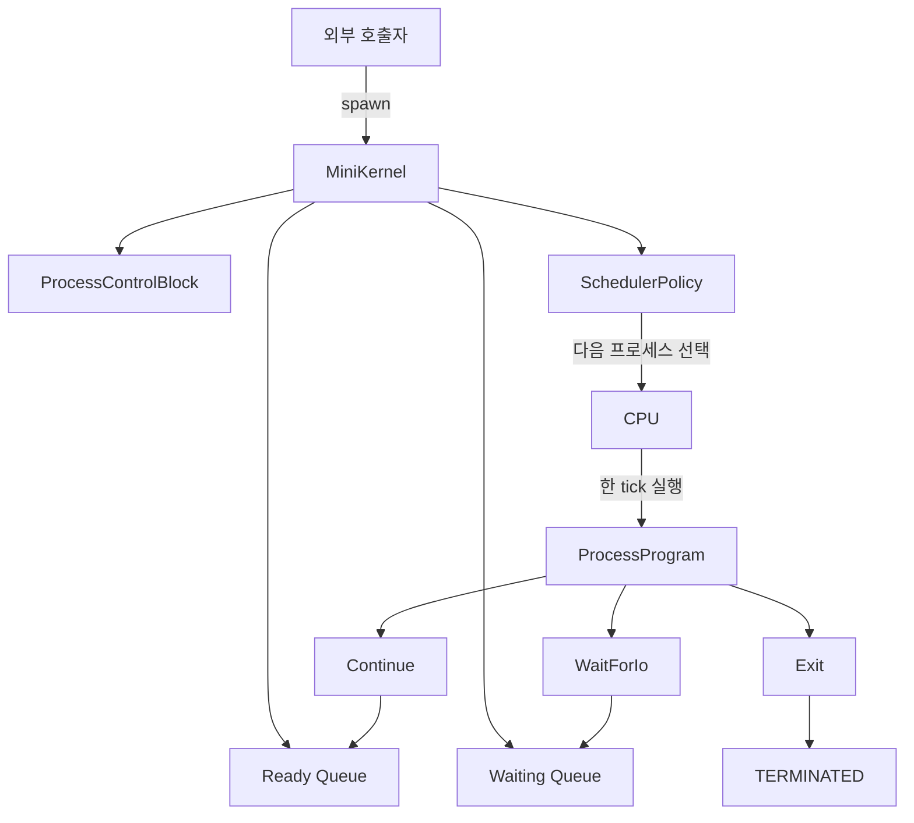

# 첫 번째 작업: OS Scheduler

## 큰 그림

> 운영체제의 프로세스와 CPU가 어떻게 협력하는지 직접 만들어 봅니다.



```text
spawn
→ READY
→ RUNNING
→ Continue, WaitForIo, Exit
→ READY, WAITING, TERMINATED
```

## 대표 구현

### Kotlin

- `ProcessProgram`: 한 tick 실행 후 신호를 반환하는 프로그램
- `ProcessSignal`: `Continue`, `WaitForIo`, `Exit`
- `ProcessControlBlock`: 커널이 관리하는 프로세스 상태
- `MiniKernel`: 생성, 실행, 선점, I/O 대기, wake-up, 종료 관리
- `SchedulerPolicy`: Ready Queue에서 다음 프로세스를 선택
- `RoundRobinPolicy`: quantum 기반 정책

### HTML

- `kernel-visualizer.html`: 프로세스 생성과 신호, 상태 전환 시각화
- `round-robin-visualizer.html`: Round Robin 실행 순서 시각화
- `eevdf-visualizer.html`: EEVDF의 lag와 virtual deadline 시각화

### 참고

- [프로토타입 스터디 Notion](https://app.notion.com/p/3c18db64698e80b7a2deea620ad0f64e)
- [OS Scheduler 구현 코드](../os-scheduler/README.md)

## 작업 로그

### 2026-08-12 수요일

- Round Robin 개념과 PCB, 문맥 전환을 정리했습니다.
- [Python으로 Round Robin 시뮬레이터](../os-scheduler/round_robin.py)를 만들었습니다.
- [Kotlin으로 Round Robin 구현](../os-scheduler/src/main/kotlin/scheduler/RoundRobinPolicy.kt)을 시작했습니다.
- [Round Robin HTML 시각화](../os-scheduler/round-robin-visualizer.html)를 만들었습니다.
- SJF와 EEVDF의 선택 원리를 공부했습니다.
- [EEVDF의 `lag`, `eligible`, `virtual deadline`](../os-scheduler/EevdfScheduler.kt)을 단순 모델로 만들었습니다.
- [EEVDF HTML 시각화](../os-scheduler/eevdf-visualizer.html)를 만들었습니다.

### 2026-08-19 수요일

- [`arrivalTime`, `burstTime`을 커널이 미리 아는 모델](../os-scheduler/process.py)의 문제를 확인했습니다.
- 프로세스가 실행 결과를 신호로 반환하는 구조로 바꿨습니다.
- [`MiniKernel`](../os-scheduler/src/main/kotlin/scheduler/MiniKernel.kt)을 추가했습니다.
- [`ProcessProgram`과 `ProcessSignal`](../os-scheduler/src/main/kotlin/scheduler/ProcessModel.kt)을 추가했습니다.
- [`Continue`, `WaitForIo`, `Exit`에 따른 상태 전환`](../os-scheduler/src/main/kotlin/scheduler/MiniKernel.kt)을 구현했습니다.
- [`SchedulerPolicy`와 `RoundRobinPolicy`](../os-scheduler/src/main/kotlin/scheduler/SchedulerPolicy.kt)를 분리했습니다.
- [Kotlin 테스트](../os-scheduler/src/test/kotlin/scheduler/MiniKernelTest.kt)를 추가했습니다.
- [프로세스를 생성하고 한 tick씩 실행하는 HTML](../os-scheduler/kernel-visualizer.html)을 만들었습니다.
- [HTML에서 Round Robin과 FCFS를 선택하고 quantum을 설정](../os-scheduler/kernel-visualizer.html)할 수 있게 했습니다.
